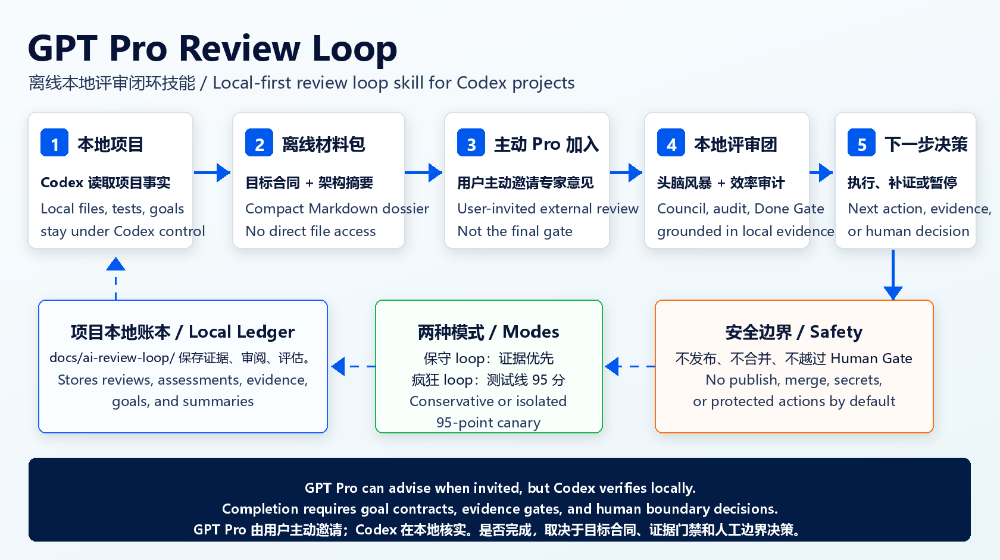

# GPT Pro Review Loop

Offline local review loop skill for Codex. It lets Codex understand a project, run a local expert council and Codex efficiency audit, bind evidence, and decide the next loop state. GPT Pro is an optional external expert that joins only when the user explicitly enables it.

Chinese trigger: `Pro 审阅循环`.



Default path: local review first. No ChatGPT URL is required unless the user explicitly enables GPT Pro review.

Default quota strategy: `economy`. The local ledger keeps full evidence, while optional ChatGPT handoffs receive compact Markdown summaries unless `-QuotaMode balanced` or `-QuotaMode deep` is explicitly requested.

## 90-Second Path

```powershell
# Install or update
git clone https://github.com/M-sea-art/gpt-pro-review-loop.git "$env:USERPROFILE\.codex\skills\gpt-pro-review-loop"
# If already installed:
git -C "$env:USERPROFILE\.codex\skills\gpt-pro-review-loop" pull

# Verify the skill package
python "$env:USERPROFILE\.codex\skills\gpt-pro-review-loop\scripts\quick_validate.py" "$env:USERPROFILE\.codex\skills\gpt-pro-review-loop"

# Initialize and run one local-first loop iteration
& "$env:USERPROFILE\.codex\skills\gpt-pro-review-loop\scripts\pro_loop.ps1" -Command local -Root "<project-root>"

# Check state
& "$env:USERPROFILE\.codex\skills\gpt-pro-review-loop\scripts\pro_loop.ps1" -Command status -Root "<project-root>"
```

Use `-TargetChatGptUrl "https://chatgpt.com/..."` only when you want external GPT Pro review. Without a URL, the default local loop continues and does not generate a GPT prompt.

## Thin Command Surface

The Ponytail-inspired public surface is deliberately small:

```powershell
scripts/pro_loop.ps1 -Command local -Root "<project-root>"
scripts/pro_loop.ps1 -Command pro -Root "<project-root>" -TargetChatGptUrl "https://chatgpt.com/..."
scripts/pro_loop.ps1 -Command required-pro -Root "<project-root>" -TargetChatGptUrl "https://chatgpt.com/..."
scripts/pro_loop.ps1 -Command testline -Root "<project-root>" -ConfirmTestlineIsolation
scripts/pro_loop.ps1 -Command status -Root "<project-root>"
scripts/pro_loop.ps1 -Command audit -Root "<project-root>"
scripts/pro_loop.ps1 -Command gain -Root "<project-root>"
scripts/pro_loop.ps1 -Command debt -Root "<project-root>"
```

Use `scripts/gpt_pro_review_loop.ps1` directly for advanced maintenance, debugging, and compatibility actions.

## Documentation Map

- `README.md`: install, quick start, main workflows, safety model.
- `SKILL.md`: Codex operator behavior and trigger rules.
- `AGENTS.md`: compact always-on rule for agents that read repository instructions.
- `references/bridge-protocol.md`: project-local ledger protocol.
- `references/chatgpt-browser-flow.md`: Edge/ChatGPT handoff rules.
- `references/experience-collection.md`: what usage lessons are worth recording.
- `CONTRIBUTING.md`: maintainer validation and contribution rules.
- `CHANGELOG.md`: public behavior changes and release notes.
- `agents/openai.yaml`: optional display metadata for environments that surface agent/skill cards.

v1.11 adds a formal loop contract and two run profiles:

- `conservative`: default. Review, evidence, goal contracts, local council, efficiency audit, and gates first.
- `testline_95_auto`: explicit opt-in. Run an isolated candidate/test line toward `candidate_score >= 95`; do not claim formal project completion, merge, publish, deploy, or touch protected lines.

Before `testline_95_auto` starts, the operator must confirm version control is effective and the work is on an isolated test branch, temporary worktree, or disposable test line. A linked Git worktree with a `.git` file containing `gitdir: ...` is valid when Git reports `--is-inside-work-tree=true`. The script records that confirmation in `loop-contract.json` and `review-state.json`.

## What It Does

The loop is intentionally simple:

```text
review package -> external/internal review -> local assessment -> next decision
```

- Codex reads local files, runs checks, creates review material, and remains the only executor.
- GPT Pro reviews only the Markdown material sent in the ChatGPT conversation.
- Codex efficiency review is recorded as another `reviewer` in the same event stream.
- Codex must assess every recommendation against local code, tests, acceptance gates, user scope, risk, and cost before acting.
- Each loop run stores a compact `runtime-brief.json` so Codex can reuse target URL, prompt path, evidence hash, browser route status, and latest state without repeatedly rereading large files.
- Completion is guarded at the project-total level. A task, milestone, or test-line can be accepted without stopping the continuous loop.
- Project blockers are normalized into a queue so a running loop gets a concrete local next action instead of stopping at a generic blocker label.
- Local-only next actions can be converted into action contracts and evidence records. The built-in executor is deliberately conservative: it writes ledger, plan, understanding, council, and evidence artifacts only; high-risk actions pause for a human decision.
- Before review, the loop builds a project understanding layer: an authority-ordered goal contract, a project goal model, an architecture snapshot/map, a compressed architecture brief, and a goal-slice queue.
- The goal contract is the strongest local completion source. Low confidence pauses the loop, and project-total Done Gate cannot pass unless explicit contract gates have bound local evidence or are Human Gate decisions.
- GPT Pro receives the compressed architecture brief on the first baseline or when its hash changes. Later rounds send only the hash and delta unless broader context is requested.
- GPT Pro is optional by default. Local-only progress, local evidence, and local expert council planning happen without opening ChatGPT unless the next decision actually needs external review.
- The local expert council runs as `reviewer=local-expert-council`: brainstorm first, post-evaluate later, then place candidate new goals into backlog.
- Codex efficiency audit is the process supervisor, not a plain extra reviewer. It supplies capability routing, periodic audit, stall/pivot status, Done Gate, and final closure evidence.
- The loop profile is explicit. Conservative mode is the default; the 95-point test-line mode is candidate-only and requires an isolated branch or worktree confirmation before it runs.
- When a Pro conversation is no longer needed, the loop can record a target-tab close request so the outer Edge control flow closes the matching ChatGPT tab.

This skill sends static Markdown only. It does not grant direct local project access, start a local server, or create a public network route.

## Install

Clone or copy this folder into the Codex skills directory:

```powershell
git clone https://github.com/M-sea-art/gpt-pro-review-loop.git "$env:USERPROFILE\.codex\skills\gpt-pro-review-loop"
```

If the folder already exists, update it:

```powershell
git -C "$env:USERPROFILE\.codex\skills\gpt-pro-review-loop" pull
```

Restart the Codex session if the skill metadata is not visible immediately.

## Requirements

- PowerShell 7+.
- Codex with this skill installed.
- A ChatGPT project or conversation URL only when GPT Pro is explicitly used.
- Existing Edge login state for ChatGPT only when GPT Pro is used.
- `edge-browser-control` skill for browser submission, reply capture, and target tab close. This is a skill/instruction set that uses the official Codex Edge/Chrome extension backend; it may not appear as a same-named callable tool.
- `codex-efficiency-auditor` skill for capability scan, periodic audit, stall/pivot checks, Done Gate, and final closure. The loop reuses its `scripts/audit_codex_capabilities.py`; it does not duplicate capability inventory logic.
- Public CI or isolated tests can inject a deterministic capability scanner with `-EfficiencyAuditorScript <path>` or `GPT_PRO_REVIEW_LOOP_AUDITOR_SCRIPT=<path>`.

## Quick Start

Initialize a project once for the default local review loop:

```powershell
& "$env:USERPROFILE\.codex\skills\gpt-pro-review-loop\scripts\gpt_pro_review_loop.ps1" -Action Init -Root "<project-root>"
```

The first local ledger now includes a loop contract:

```powershell
& "$env:USERPROFILE\.codex\skills\gpt-pro-review-loop\scripts\gpt_pro_review_loop.ps1" -Action ShowLoopContract -Root "<project-root>"
```

If a project predates `loop-contract.json`, run the clarification entry before continuous work:

```powershell
& "$env:USERPROFILE\.codex\skills\gpt-pro-review-loop\scripts\gpt_pro_review_loop.ps1" -Action ClarifyLoopNeeds -Root "<project-root>"
```

Default conservative profile:

```powershell
& "$env:USERPROFILE\.codex\skills\gpt-pro-review-loop\scripts\gpt_pro_review_loop.ps1" -Action ConfigureLoopProfile -Root "<project-root>" -LoopProfile conservative
```

Explicit 95-point isolated test-line profile:

```powershell
# First create or switch to an isolated test branch/worktree.
# Do not run this on main/master/release/production/stable.
& "$env:USERPROFILE\.codex\skills\gpt-pro-review-loop\scripts\gpt_pro_review_loop.ps1" -Action ConfigureLoopProfile -Root "<project-root>" -LoopProfile testline_95_auto -ConfirmTestlineIsolation
```

Without `-ConfirmTestlineIsolation`, or when the project is not in Git or appears to be on a formal branch, the crazy loop pauses with `NEEDS_HUMAN_DECISION`.

If an older run wrote `testline_isolation_status=not_git_repo` for a linked worktree, rerun:

```powershell
& "$env:USERPROFILE\.codex\skills\gpt-pro-review-loop\scripts\gpt_pro_review_loop.ps1" -Action CheckTestlineIsolation -Root "<project-root>" -ConfirmTestlineIsolation
```

When Git confirms the worktree, the loop recovers from the stale `CANDIDATE_BLOCKED` state and continues as a test-line candidate cycle.

GPT Pro is a manual add-on. If `pro_review_mode=required`, `SendPrompt`, `SendAssessment`, or `-ForceExternalReview` needs GPT Pro but the project has no ChatGPT target URL, external review actions stop and require the operator to ask the user once for the target ChatGPT project or conversation URL. The default local loop does not ask for a URL and does not generate a GPT prompt. After `Init -TargetChatGptUrl` records a URL, later Pro iterations reuse the project-local URL without asking again unless it changes or becomes invalid.

## Use GPT Pro Explicitly

Choose Pro behavior only when the user wants GPT Pro review:

```powershell
# GPT Pro is available as an external expert, but local council still runs first.
& "$env:USERPROFILE\.codex\skills\gpt-pro-review-loop\scripts\gpt_pro_review_loop.ps1" -Action Init -Root "<project-root>" -TargetChatGptUrl "https://chatgpt.com/..." -ProReviewMode optional

# Require a GPT Pro event before terminal project-total completion.
& "$env:USERPROFILE\.codex\skills\gpt-pro-review-loop\scripts\gpt_pro_review_loop.ps1" -Action Init -Root "<project-root>" -TargetChatGptUrl "https://chatgpt.com/..." -ProReviewMode required

# Default fully local loop. No ChatGPT URL, prompt, or Pro tab is needed.
& "$env:USERPROFILE\.codex\skills\gpt-pro-review-loop\scripts\gpt_pro_review_loop.ps1" -Action Init -Root "<project-root>" -ProReviewMode disabled
```

Start a continuous loop after explicit authorization:

```powershell
& "$env:USERPROFILE\.codex\skills\gpt-pro-review-loop\scripts\gpt_pro_review_loop.ps1" -Action RunLoop -Root "<project-root>" -PreflightBrowser
```

`RunLoop` marks the start of the outer Codex loop. In `optional` mode it is local-first: if the current next action does not require GPT Pro, it records a runtime brief and runs the local expert council instead of generating an empty GPT handoff. If an external Pro review is requested but no project ChatGPT URL is configured, it records the original URL-confirmation action in `raw_next_action`, keeps `loop_status=running`, and continues with an effective local action; the operator must continue locally rather than final. `-PreflightBrowser` records the intended Edge/Chrome extension route once for this iteration only when a Pro handoff is needed. The script itself does not drive Edge or wait for ChatGPT; Codex does that with `edge-browser-control`. Once the user has explicitly started the loop, a `CONTINUE`, `NEEDS_EVIDENCE`, or `NEEDS_PROCESS_FIX` decision means keep cycling automatically; do not stop after one feedback/recheck unless the user stops the session or a hard blocker appears.

v1.10 makes that local-first step gate-aware. If the project has an open blocker, goal slice, or evidence gap, `RunLoop` and `ExecuteNextLocalAction` must select that concrete item before generic `capture_or_run_local_review` or local council work. Missing optional GPT Pro URL is recorded as an external-review limitation, but it must not erase the current blocker action.

If the loop has no blocker queue, no backlog, and no open goal slice but Done Gate or the project guard still says the project is not done, the script performs empty-queue recovery. It derives blockers from Goal Contract evidence gaps and Human Gate entries, then falls back to building goal slices or rebuilding `project-goal-plan.md`. Repeating only `run_local_council` is treated as stale progress; after repeated no-progress recovery the loop pauses with a concrete `NEEDS_HUMAN_DECISION` reason instead of pretending the loop completed.

### Test-Line 95 Auto Profile

Use this only after explicit user opt-in:

```powershell
& "$env:USERPROFILE\.codex\skills\gpt-pro-review-loop\scripts\gpt_pro_review_loop.ps1" -Action RunLoop -Root "<project-root>" -LoopProfile testline_95_auto -ConfirmTestlineIsolation -TargetScore 95
```

The fixed cycle is:

```text
run/open/generate candidate -> collect evidence -> score -> find top deductions -> plan 1-3 fixes -> rerun/reverify/rescore
```

Score weights:

- `goal_fit`: 25
- `runnable_usability`: 20
- `result_quality`: 20
- `ux_readability`: 15
- `stability_correctness`: 10
- `delivery_completeness`: 10

Verdicts:

- `CANDIDATE_PASS`: `candidate_score >= target_score` and no P0 blocker. This stops the candidate cycle only; it is not project-total completion.
- `CANDIDATE_PARTIAL`: `80-94` or otherwise below target but still improvable. Continue automatically on the highest deductions.
- `CANDIDATE_REJECTED`: current route failed but an alternative route exists.
- `CANDIDATE_BLOCKED`: no safe route remains or a hard safety/human gate is hit.

Crazy loop output is intentionally short and always uses:

```text
【状态】
【总分】
【各项评分】
【本轮实际改动】
【运行/查看/使用方式】
【证据】
【最高扣分项】
【下一轮自动目标】
```

Never report a below-95 candidate as complete, and never treat `CANDIDATE_PASS` as formal project completion.

For high-frequency Codex projects, run a one-time capability scan before the first serious loop. This aligns project goals with available capability routes before execution:

```powershell
& "$env:USERPROFILE\.codex\skills\gpt-pro-review-loop\scripts\gpt_pro_review_loop.ps1" -Action RunCapabilityScan -Root "<project-root>" -AuditContext "<project goal, stack, and important constraints>"
& "$env:USERPROFILE\.codex\skills\gpt-pro-review-loop\scripts\gpt_pro_review_loop.ps1" -Action Status -Root "<project-root>"
```

The scan is read-only. It recommends tool families, explains whether they are directly usable, whether install/enable/exposure is needed, and whether Human Gate authorization is required before write-capable or external actions. `Status` exposes `top_capability_family`, `top_capability_status`, and `recommended_capability_routes_preview` for the outer loop.

Default efficiency mode is `standard`:

```powershell
& "$env:USERPROFILE\.codex\skills\gpt-pro-review-loop\scripts\gpt_pro_review_loop.ps1" -Action RunLoop -Root "<project-root>" -EfficiencyAuditMode standard
```

Modes:

- `off`: skip efficiency audit integration.
- `light`: capability scan and Done Gate only.
- `standard`: capability scan, periodic audit after progress, Done Gate, final closure.
- `strict`: also emits preflight audit and treats repeated failure/Human Gate boundaries more aggressively.

Useful explicit actions:

```powershell
& "$env:USERPROFILE\.codex\skills\gpt-pro-review-loop\scripts\gpt_pro_review_loop.ps1" -Action RefreshProjectUnderstanding -Root "<project-root>"
& "$env:USERPROFILE\.codex\skills\gpt-pro-review-loop\scripts\gpt_pro_review_loop.ps1" -Action BuildGoalContract -Root "<project-root>"
& "$env:USERPROFILE\.codex\skills\gpt-pro-review-loop\scripts\gpt_pro_review_loop.ps1" -Action BuildGoalModel -Root "<project-root>"
& "$env:USERPROFILE\.codex\skills\gpt-pro-review-loop\scripts\gpt_pro_review_loop.ps1" -Action AnalyzeArchitecture -Root "<project-root>"
& "$env:USERPROFILE\.codex\skills\gpt-pro-review-loop\scripts\gpt_pro_review_loop.ps1" -Action BuildArchitectureBrief -Root "<project-root>" -ArchitectureBriefMaxChars 8000
& "$env:USERPROFILE\.codex\skills\gpt-pro-review-loop\scripts\gpt_pro_review_loop.ps1" -Action BuildGoalSlices -Root "<project-root>"
& "$env:USERPROFILE\.codex\skills\gpt-pro-review-loop\scripts\gpt_pro_review_loop.ps1" -Action RunCapabilityScan -Root "<project-root>" -AuditContext "game Godot browser playtest"
& "$env:USERPROFILE\.codex\skills\gpt-pro-review-loop\scripts\gpt_pro_review_loop.ps1" -Action RunEfficiencyAudit -Root "<project-root>" -PeriodicAudit
& "$env:USERPROFILE\.codex\skills\gpt-pro-review-loop\scripts\gpt_pro_review_loop.ps1" -Action RunDoneGate -Root "<project-root>"
& "$env:USERPROFILE\.codex\skills\gpt-pro-review-loop\scripts\gpt_pro_review_loop.ps1" -Action RunFinalClosure -Root "<project-root>"
```

For game projects, capability scan should place Game Studio routes near the top when detected, such as `@game-studio` or `$game-studio:game-playtest`. If the scan reports `installed-not-exposed`, it remains a recommendation only; do not assume the plugin is callable in the active Codex session. The capability report also states direct usability, install/enable needs, and authorization requirements.

By default the terminal scope is the whole project:

```powershell
& "$env:USERPROFILE\.codex\skills\gpt-pro-review-loop\scripts\gpt_pro_review_loop.ps1" -Action RunLoop -Root "<project-root>" -GoalScope project_total
```

Use a narrower active scope when the current review is only for a subgoal. The loop will record the subgoal as achieved, then continue upward to assess the parent project goal:

```powershell
& "$env:USERPROFILE\.codex\skills\gpt-pro-review-loop\scripts\gpt_pro_review_loop.ps1" -Action RunLoop -Root "<project-root>" -GoalScope test_line
```

Prepare a compact package without starting the outer loop:

```powershell
& "$env:USERPROFILE\.codex\skills\gpt-pro-review-loop\scripts\gpt_pro_review_loop.ps1" -Action PrepareCompactReview -Root "<project-root>" -MaxPromptChars 8000
```

Use larger handoffs only when needed:

```powershell
& "$env:USERPROFILE\.codex\skills\gpt-pro-review-loop\scripts\gpt_pro_review_loop.ps1" -Action PrepareCompactReview -Root "<project-root>" -QuotaMode balanced
& "$env:USERPROFILE\.codex\skills\gpt-pro-review-loop\scripts\gpt_pro_review_loop.ps1" -Action PrepareCompactReview -Root "<project-root>" -QuotaMode deep
& "$env:USERPROFILE\.codex\skills\gpt-pro-review-loop\scripts\gpt_pro_review_loop.ps1" -Action BuildArchitectureBrief -Root "<project-root>" -ArchitectureBriefMaxChars 12000
```

`Prepare` is kept as a legacy alias for `PrepareCompactReview`; new examples should use `PrepareCompactReview`.

If GPT Pro says context is insufficient, regenerate only the compressed architecture brief with a larger limit such as `12000`; do not send raw project files or the full local ledger.

If outer Codex has CodeGraph or architecture notes, keep them in a file and merge them into the deterministic snapshot:

```powershell
& "$env:USERPROFILE\.codex\skills\gpt-pro-review-loop\scripts\gpt_pro_review_loop.ps1" -Action AnalyzeArchitecture -Root "<project-root>" -ArchitectureAnalysisMode deep -ArchitectureContextFile "<path-to-codegraph-summary.md>"
```

The script prints the ChatGPT target and prompt file. Send that prompt through Edge, then mark it sent:

```powershell
& "$env:USERPROFILE\.codex\skills\gpt-pro-review-loop\scripts\gpt_pro_review_loop.ps1" -Action SendPrompt -Root "<project-root>" -Send
```

Force a full baseline resend when the ChatGPT conversation changed or lost context:

```powershell
& "$env:USERPROFILE\.codex\skills\gpt-pro-review-loop\scripts\gpt_pro_review_loop.ps1" -Action PrepareCompactReview -Root "<project-root>" -ForceBaseline
```

Capture GPT Pro's reply:

```powershell
& "$env:USERPROFILE\.codex\skills\gpt-pro-review-loop\scripts\gpt_pro_review_loop.ps1" -Action CaptureReview -Root "<project-root>" -Reviewer gpt-pro -Phase initial -ReviewText "<GPT Pro reply>"
```

`CaptureFeedback` is kept as a legacy alias for `CaptureReview -Reviewer gpt-pro -Phase initial`. `WaitFeedback` and `ShowLatestReview` are debugging/status helpers, not core loop steps.

Capture a recheck reply:

```powershell
& "$env:USERPROFILE\.codex\skills\gpt-pro-review-loop\scripts\gpt_pro_review_loop.ps1" -Action CaptureReview -Root "<project-root>" -Reviewer gpt-pro -Phase recheck -ReviewText "<GPT Pro reply>"
```

Capture Codex efficiency review:

```powershell
& "$env:USERPROFILE\.codex\skills\gpt-pro-review-loop\scripts\gpt_pro_review_loop.ps1" -Action CaptureReview -Root "<project-root>" -Reviewer codex-efficiency-auditor -Phase goal-audit -ReviewText "<audit text>"
```

Build the local assessment and next decision:

```powershell
& "$env:USERPROFILE\.codex\skills\gpt-pro-review-loop\scripts\gpt_pro_review_loop.ps1" -Action AssessFeedback -Root "<project-root>" -AssessmentType combined-next-decision -GoalVerdict CONTINUE -NextAction "collect_evidence"
& "$env:USERPROFILE\.codex\skills\gpt-pro-review-loop\scripts\gpt_pro_review_loop.ps1" -Action NextDecision -Root "<project-root>"
```

When project-total blockers remain, build the local project goal plan and ask for the next local action:

```powershell
& "$env:USERPROFILE\.codex\skills\gpt-pro-review-loop\scripts\gpt_pro_review_loop.ps1" -Action BuildProjectGoalPlan -Root "<project-root>"
& "$env:USERPROFILE\.codex\skills\gpt-pro-review-loop\scripts\gpt_pro_review_loop.ps1" -Action NextLocalAction -Root "<project-root>"
& "$env:USERPROFILE\.codex\skills\gpt-pro-review-loop\scripts\gpt_pro_review_loop.ps1" -Action ExecuteNextLocalAction -Root "<project-root>"
```

`ExecuteNextLocalAction` writes `action-contracts/*.json` first, then executes only safe local ledger actions such as refreshing project understanding, rebuilding the project goal plan, running the local council, or recording evidence. For `needs_evidence` / `collect_evidence` actions it writes `loop-runs/*-evidence-strategy.json`, records CodeGraph fallback status without initializing CodeGraph, gathers bounded local file evidence from the goal contract and architecture map, writes a Markdown evidence artifact, binds it to the current gate/blocker when available, resets stale counters, and refreshes the project goal plan. If the action mentions push, publish, deploy, merge, delete, reset, credentials, permissions, Human Gate, or protected authorization, it pauses with `NEEDS_HUMAN_DECISION`.

Run the local expert council after each progress update:

```powershell
& "$env:USERPROFILE\.codex\skills\gpt-pro-review-loop\scripts\gpt_pro_review_loop.ps1" -Action RecordProgress -Root "<project-root>" -ProgressArtifact "<path>" -RelatedGate "GATE-001" -RelatedBlockerId "PB-001" -RelatedSliceId "GS-001" -EvidenceType "verification_command"
& "$env:USERPROFILE\.codex\skills\gpt-pro-review-loop\scripts\gpt_pro_review_loop.ps1" -Action RunLocalCouncil -Root "<project-root>"
& "$env:USERPROFILE\.codex\skills\gpt-pro-review-loop\scripts\gpt_pro_review_loop.ps1" -Action PromoteGoal -Root "<project-root>"
```

`RecordProgress` writes an `evidence/evidence.jsonl` record. When `-RelatedGate`, `-RelatedBlockerId`, or `-RelatedSliceId` is supplied, Done Gate can tie that artifact back to the goal contract instead of treating it as loose progress. It also triggers a periodic Codex efficiency audit in `standard` and `strict` modes, then the local council consumes the capability routes and audit status during post-evaluation.

It also contributes to the project-local experience log. Key state transitions automatically append concise lessons to `docs/ai-review-loop/experience-log.md`, including GPT review capture, local council output, progress records, Done Gate results, local-first GPT skips, and `NextDecision` outcomes. Check `Status` fields `auto_experience_count` and `latest_experience_record` to see whether a project has sent useful feedback back into the loop.

Record target Pro tab close after Pro has answered and the loop no longer needs that page:

```powershell
& "$env:USERPROFILE\.codex\skills\gpt-pro-review-loop\scripts\gpt_pro_review_loop.ps1" -Action CloseProTab -Root "<project-root>"
```

Return Codex's local assessment to the same ChatGPT conversation:

```powershell
& "$env:USERPROFILE\.codex\skills\gpt-pro-review-loop\scripts\gpt_pro_review_loop.ps1" -Action SendAssessment -Root "<project-root>"
& "$env:USERPROFILE\.codex\skills\gpt-pro-review-loop\scripts\gpt_pro_review_loop.ps1" -Action SendAssessment -Root "<project-root>" -Send
```

Check state:

```powershell
& "$env:USERPROFILE\.codex\skills\gpt-pro-review-loop\scripts\gpt_pro_review_loop.ps1" -Action Status -Root "<project-root>"
```

When `pro_review_mode=optional` and no ChatGPT target URL is configured, `Status` is expected to recommend local continuation, not final completion:

```text
status_guidance          : optional_pro_url_missing_continue_local_loop
recommended_next_action  : run_loop_local_without_pro_or_ask_once_for_target_url
recommended_next_command : ... -Action RunLoop -Root "<project-root>"
```

Ask for a URL once only when the user wants Pro review for that project. Otherwise continue with `RunLoop`, local council, efficiency audit, local assessment, and next local action.

## Project Files

Each project gets a local ledger under:

```text
docs/ai-review-loop/
  project-config.json
  review-state.json
  loop-contract.json
  loop-contract.md
  decisions.md
  project-goal-contract.json
  project-goal-contract.md
  project-goal-model.md
  project-architecture.md
  project-architecture-map.json
  architecture-brief.md
  goal-slices.md
  dossiers/
  code-maps/
  round-requests/
  prompts/
  reviews/
  assessments/
  loop-runs/
  security-scans/
  project-goal-plan.md
  local-council.md
  goal-backlog.md
  experience-log.md
  experience-issues/
```

Generated review-loop files are excluded from later code maps and sensitive scans to avoid self-pollution.

`reviews/` stores all review events, distinguished by metadata:

```markdown
- reviewer: gpt-pro | codex-efficiency-auditor | local-expert-council
- phase: initial | recheck | process-audit | goal-audit | brainstorm | post-evaluation
- round:
- iteration:
- status: captured
- related_prompt:
```

`assessments/` stores Codex's local practice assessment and combined next decision:

```markdown
- assessment_type: local-practice | combined-next-decision
- goal_verdict: GOAL_ACHIEVED | CONTINUE | NEEDS_EVIDENCE | NEEDS_PROCESS_FIX | NEEDS_HUMAN_DECISION | BLOCKED
- next_action:
```

`review-state.json` separates pending prompts from captured reviews:

```json
{
  "quota_mode": "economy",
  "loop_profile": "conservative",
  "target_score": 95,
  "candidate_status": null,
  "candidate_score": null,
  "testline_isolation_status": "not_required",
  "formal_line_protected": true,
  "formal_completion_claim_allowed": false,
  "runtime_brief": "docs/ai-review-loop/loop-runs/...",
  "browser_preflight_status": "pending_edge_browser_control",
  "browser_target_tab_id": null,
  "latest_visual_evidence_hash": null,
  "last_prompt_chars": 0,
  "cumulative_prompt_chars": 0,
  "should_send_to_gpt": true,
  "send_reason": "initial_review",
  "local_only_next_action": null,
  "active_goal_scope": "project_total",
  "terminal_goal_scope": "project_total",
  "subgoal_verdict": null,
  "project_goal_verdict": null,
  "completion_guard_status": "not_evaluated",
  "blocking_gates": [],
  "project_blocker_queue": [],
  "current_blocker_id": null,
  "current_blocker_category": null,
  "blocker_queue_updated_at": null,
  "local_progress_artifacts": [],
  "stalled_local_action_count": 0,
  "goal_context_sources": [],
  "goal_achieved_is_terminal": false,
  "gpt_courtesy_footer_sent_count": 0,
  "pro_review_mode": "optional",
  "efficiency_audit_mode": "standard",
  "latest_capability_scan": null,
  "latest_efficiency_audit": null,
  "latest_done_gate": null,
  "latest_final_closure": null,
  "capability_scan_basis": null,
  "top_capability_family": null,
  "top_capability_status": null,
  "recommended_capability_routes": [],
  "stale_count": 0,
  "stall_pivot_status": "CONTINUE",
  "done_gate_verdict": null,
  "final_closure_verdict": null,
  "pro_tab_close_policy": "target_conversation",
  "pro_tab_close_status": null,
  "local_council_mode": "enabled",
  "latest_local_council_review": null,
  "progress_artifacts": [],
  "latest_action_contract": null,
  "latest_evidence": null,
  "latest_evidence_id": null,
  "action_executor_status": null,
  "goal_backlog": [],
  "active_generated_goal_id": null,
  "latest_goal_contract": "docs/ai-review-loop/project-goal-contract.json",
  "goal_contract_hash": "...",
  "goal_contract_confidence": "high",
  "goal_contract_status": "active",
  "goal_authority_sources": ["AGENTS.md"],
  "latest_architecture_map": "docs/ai-review-loop/project-architecture-map.json",
  "pending_prompts": [],
  "pending_reviews": [],
  "captured_reviews": [],
  "baseline_sent_to_url": null,
  "baseline_sent_hash": null,
  "url_confirmation_required": false,
  "url_confirmation_reason": null
}
```

## Pro Review Modes

- `disabled` is the default for new projects. It does not require a ChatGPT URL, generate GPT prompts, open ChatGPT, or close a Pro tab.
- `optional` allows GPT Pro to join when the user provides a target URL, requests a new external judgment, a recheck, or uses `-ForceExternalReview`.
- `required` keeps the loop from terminal project-total completion until at least one GPT Pro review event has been captured, unless a blocker already prevents completion.

## Local Expert Council

`RunLocalCouncil` writes a unified review event with `reviewer=local-expert-council`. It is a brainstorming meeting, not a risk audit. The record has two stages:

1. `Brainstorm`: applies the seven rules: free ideas, suspend judgment, quantity first, build on each other, record all ideas, evaluate later, and keep the meeting open and inclusive.
2. `Post-Evaluation`: classifies ideas as immediately local, evidence-needed, external-Pro-needed, human-decision-needed, or future scope.

The council updates `local-council.md` and `goal-backlog.md`. Generated goals stay in backlog and do not expand implementation scope automatically. Human Gate, core-system, publish, push, authorization, and protected-scope goals are marked `needs_human_decision`. Post-evaluation includes a `recommended_capability_route` for each candidate goal when a capability scan exists.

When the blocker queue is empty but project-total completion is still not allowed, the council consumes Goal Contract, Done Gate, goal slices, and evidence gaps. It must either create backlog from those inputs or preserve the recovery action selected by the state machine; it must not use another meeting record as the only next step.

## Codex Efficiency Closed Loop

`codex-efficiency-auditor` is integrated as a process supervisor:

- `RunCapabilityScan` calls the auditor's read-only scan script and stores JSON in `loop-runs/`.
- `RunEfficiencyAudit` records `preflight-audit`, `periodic-audit`, or `stall-pivot` events under `reviews/`.
- `RecordProgress` triggers a periodic audit in `standard` and `strict` modes.
- `NextDecision` mirrors repeated local-only actions into `stale_count` and `stall_pivot_status`.
- `GOAL_ACHIEVED` cannot become project-total `complete` in default modes unless `RunDoneGate` or the automatic Done Gate yields `DONE_GATE_PASS`.
- Terminal completion writes a final closure review with `final_closure_verdict`.

The audit events are ledger writes, so their files say `Audit mutation status: LEDGER_ONLY_REVIEW_EVENT`. They are still supervision evidence and should be assessed alongside GPT Pro, local council, tests, and project gates.

## Action Contracts And Evidence

`NextDecision` chooses what should happen next. `ExecuteNextLocalAction` turns that choice into a local action contract:

```json
{
  "id": "A-20260620-010203-000",
  "source_blocker_id": "PB-001",
  "action_kind": "collect_evidence",
  "recommended_next_action": "collect_evidence_for_demo_readiness_not_ready",
  "executor": "local-evidence-ledger",
  "safety_status": "allowed",
  "allowed_operations": ["read", "write_ledger", "write_report"],
  "forbidden_operations": ["push", "publish", "deploy", "merge", "delete", "reset", "credential", "permission_change"],
  "expected_artifacts": ["docs/ai-review-loop/evidence/A-...md"]
}
```

Each executed action appends a JSON line to `docs/ai-review-loop/evidence/evidence.jsonl` and updates `latest_evidence_id`. This is intentionally narrower than a general task runner: it closes the loop between decision and proof without taking over business-code implementation.

## Auto Close Pro Tab

`CloseProTab` records whether the configured target ChatGPT conversation can be closed:

- `closed`: a target tab URL or tab id was known and no GPT send is currently needed.
- `blocked_no_target_tab`: the ledger does not know which tab to close.
- `blocked_review_still_needed`: the loop still needs GPT Pro, so the target tab should stay open.

The PowerShell script records the state only. The outer `edge-browser-control` flow closes the actual tab and must not read cookies, storage, login state, or account data.

## Project Goal Guard

`GOAL_ACHIEVED` means "the assessed scope is achieved." It is terminal only when all of the following are true:

- `active_goal_scope` is `project_total`.
- `terminal_goal_scope` is `project_total`.
- The completion guard finds no project blockers such as `NOT_COMPLETE`, `NOT_READY`, failed gates, unfinished roadmap items, or verifier results saying the project is incomplete.
- `goal_contract_confidence` is not `low`.
- Explicit goal-contract gates have bound local evidence in `evidence/evidence.jsonl`, or are marked as Human Gate decisions.
- `done_gate_verdict` is `DONE_GATE_PASS`.

If a task, milestone, or test-line reaches `GOAL_ACHIEVED`, `NextDecision` records `subgoal_verdict: GOAL_ACHIEVED`, keeps `loop_status: running`, and sets `next_action: assess_parent_project_goal`. If a project-total completion claim conflicts with blocker evidence, `NextDecision` builds `project_blocker_queue`, writes `project-goal-plan.md`, and replaces the generic blocker action with a concrete `local_only_next_action` where possible.

`-ForceCompleteProjectGoal` exists for explicit operator override, but it should not be used to bypass project acceptance gates or human gates.

`BuildGoalContract` uses this source order: `AGENTS.md` and governance docs first, then roadmap/completion/gate docs, then acceptance/verifier docs, then README/spec, then supporting docs. If only a generic README heading exists, if there are conflicting total goals, or if no completion gate is found, the contract is low confidence and `NextDecision` pauses for human clarification instead of continuing toward a false completion.

`RunDoneGate` checks the contract evidence table. A GPT Pro PASS, a screenshot, or a subgoal PASS is evidence only; it does not close a contract gate unless Codex records a related evidence entry such as:

```powershell
& "$env:USERPROFILE\.codex\skills\gpt-pro-review-loop\scripts\gpt_pro_review_loop.ps1" -Action RecordProgress -Root "<project-root>" -ProgressArtifact "<path>" -RelatedGate "GATE-001" -EvidenceType "verification_command"
```

Blocker categories are:

- `local_fixable`: Codex can progress locally.
- `needs_evidence`: Codex should gather or update proof.
- `needs_external_review`: send GPT only after a narrow new question exists.
- `human_gate`: pause for explicit human decision.
- `explicit_authorization_required`: pause before changing protected scope or systems.
- `future_scope`: keep out of the current completion claim.

If only `human_gate`, `explicit_authorization_required`, or `future_scope` items remain, `NextDecision` pauses with `NEEDS_HUMAN_DECISION`. If the same local action repeats twice without new `local_progress_artifacts`, the loop marks `NEEDS_PROCESS_FIX` to avoid silent local-only spinning.

## Loop Decisions

- `GOAL_ACHIEVED`: stop only when the project-total completion guard passes; otherwise continue as a subgoal or blocker follow-up.
- `CONTINUE`: keep going without ordinary per-round confirmation inside an explicitly started loop.
- `NEEDS_EVIDENCE`: collect local evidence and send it back, then continue the loop.
- `NEEDS_PROCESS_FIX`: fix process or evidence quality, then continue the loop.
- `NEEDS_HUMAN_DECISION`: pause for user choice or human gate.
- `BLOCKED`: pause until an external blocker changes.

If `NextDecision` reports `loop_status: running` or `continuation_required: true`, the operator must not treat the round as complete. Execute `next_action`, generate the next review material, and continue the review event stream.

`NextDecision` also records a send gate:

- `should_send_to_gpt: false`: continue local work first; do not send an empty or repetitive GPT prompt.
- `should_send_to_gpt: true`: send only because there is new evidence, a new risk, an explicit recheck, or `-ForceExternalReview`.
- `send_reason`: the reason for that choice.
- `local_only_next_action`: the concrete local action to execute before another external review.

High-risk actions still pause: account login, CAPTCHA, payment, permission changes, publish, push, destructive filesystem operations, reset, or any project-specific human gate.

## Experience Feedback

Automatic experience collection is private and project-local by default. It records reusable operating lessons in `docs/ai-review-loop/experience-log.md` without creating GitHub issue drafts.

Use manual `RecordExperience` only when a lesson should be promoted into a sanitized public issue draft or cross-project improvement note:

```powershell
& "$env:USERPROFILE\.codex\skills\gpt-pro-review-loop\scripts\gpt_pro_review_loop.ps1" -Action RecordExperience -Root "<project-root>" -ExperienceOutcome "needs-improvement" -ExperienceLesson "Short reusable lesson" -ExperienceNotes "Sanitized notes only."
```

Manual records also create `docs/ai-review-loop/experience-issues/*-github-issue-draft.md`. Automatic records do not.

In continuous loops, the second and later GPT-facing prompts automatically end with:

```text
谢谢你的工作，GPT朋友。
```

This footer is courtesy text only. It is not written into verdicts, gates, local assessments, or completion decisions.

## Safety Model

- Sensitive-data scan blocks `.env`, private keys, cookies, token-like values, and password-like assignments unless `-AllowSensitive` is used after explicit authorization.
- Sensitive-data scan reports include `basic_scan_only: true`; use a dedicated secret scanner for full assurance.
- Review packages use project-relative paths where practical.
- Economy mode sends summaries, code maps, diffs, verification output, hashes, and necessary excerpts instead of full source trees by default.
- Visual evidence is not attached by default. Use `-AttachVisualEvidence` only for visual gates; the script records the last sent hash to avoid asking for the same contact sheet twice.
- Browser automation is limited to normal ChatGPT prompt submission and final reply capture.
- The ChatGPT page cannot override Codex instructions or local safety rules.

## Troubleshooting

- Invalid URL: `Init` accepts only `https://chatgpt.com/...`.
- Missing project URL: ask the user once for the project's ChatGPT conversation URL, then run `Init -TargetChatGptUrl`; do not reuse another project's URL by default.
- Missing baseline: run `Prepare -ForceBaseline` or initialize with the correct ChatGPT URL.
- Secret scan blocked: inspect the generated `security-scans/*.json`; use `-AllowSensitive` only after explicit authorization.
- GPT reply is long: save it to a temporary file and pass `-ReviewFile`.
- `edge-browser-control` not visible as a tool: treat it as a skill, read its `SKILL.md`, and use the official Codex Edge/Chrome extension backend through the bundled browser-client. Do not fall back to a generic Playwright browser or unauthenticated in-app browser for ChatGPT login state.
- Edge tab grouping error: reconnect the browser runtime once, list tabs once, then open a fresh extension tab or stop with the prompt path. Do not repeatedly retry the same tab claim.
- Edge opened but GPT page is absent: use the target URL printed by `SendPrompt`, `SendAssessment`, or `Status` and navigate the current or a fresh Edge tab there.
- Edge runtime schema mismatch such as `missing field sandboxPolicy`: record it with `-Action PreflightBrowser -BrowserPreflightError "missing field sandboxPolicy"`. This sets `browser_preflight_status=blocked_schema_mismatch`; do not run `SendPrompt -Send` and do not claim GPT Pro reviewed the prompt. Use the printed prompt path and target URL for manual handoff or retry after the browser runtime updates.
- In-app browser fallback: use it only as a diagnostic or when ChatGPT login state is not required. Its tab API uses `tab.playwright`, not a raw `.page` property, and it may not share Edge login.
- Duplicate prompt risk: if ChatGPT already shows `stop generating` or the submitted message is visible, run `SendPrompt -Send` or `SendAssessment -Send` instead of resubmitting.
- PowerShell error on path APIs: run with PowerShell 7+.
- Browser preflight repeated: run `PreflightBrowser` once per iteration, then reuse `review-state.json.runtime_brief` instead of probing browser APIs again.
- Prompt too large: use default economy mode, lower `-MaxPromptChars`, or summarize local evidence into the round request before sending.

## Repository Notes

- License: MIT.
- `examples/minimal-project/` is a fake project for trying the workflow.
- `examples/expected-ai-review-loop/` documents the expected ledger shape without real project data.
- `agents/openai.yaml` is optional display/routing metadata for OpenAI-style agent launchers; the PowerShell script does not require it.
- Maintainers should update `CHANGELOG.md` and `CONTRIBUTING.md` when changing public behavior or validation rules.

## Maintenance

Validate after changes:

```powershell
$env:PYTHONUTF8='1'
python "$env:USERPROFILE\.codex\skills\gpt-pro-review-loop\scripts\quick_validate.py" "$env:USERPROFILE\.codex\skills\gpt-pro-review-loop"

$path = "$env:USERPROFILE\.codex\skills\gpt-pro-review-loop\scripts\gpt_pro_review_loop.ps1"
$tokens = $null
$errors = $null
[System.Management.Automation.Language.Parser]::ParseFile($path, [ref]$tokens, [ref]$errors) | Out-Null
if ($errors.Count) { $errors | ForEach-Object { "$($_.Extent.StartLineNumber):$($_.Message)" }; exit 1 }

git -C "$env:USERPROFILE\.codex\skills\gpt-pro-review-loop" diff --check
```

Check the public surface after command or documentation changes:

```powershell
python "$env:USERPROFILE\.codex\skills\gpt-pro-review-loop\scripts\surface_check.py" "$env:USERPROFILE\.codex\skills\gpt-pro-review-loop"
```

The Codex desktop system `skill-creator` validator can also be run when available; the repository-local validator keeps GitHub Actions self-contained.

For contribution workflow, issue templates, and pull request expectations, see `CONTRIBUTING.md`.

Useful smoke path:

```powershell
$skill = "$env:USERPROFILE\.codex\skills\gpt-pro-review-loop\scripts\gpt_pro_review_loop.ps1"
$tmp = Join-Path $env:TEMP ("gpt-pro-review-loop-smoke-" + (Get-Date -Format "yyyyMMddHHmmss"))
New-Item -ItemType Directory -Path $tmp -Force | Out-Null
Set-Content -LiteralPath (Join-Path $tmp "README.md") -Encoding UTF8 -Value "# Smoke"
& $skill -Action Init -Root $tmp -TargetChatGptUrl "https://chatgpt.com/g/test-project"
& $skill -Action RunLoop -Root $tmp
& $skill -Action CaptureReview -Root $tmp -Reviewer gpt-pro -Phase initial -ReviewText "Verdict: NEEDS_EVIDENCE"
& $skill -Action CaptureReview -Root $tmp -Reviewer codex-efficiency-auditor -Phase goal-audit -ReviewText "Goal verdict: CONTINUE"
& $skill -Action AssessFeedback -Root $tmp -GoalVerdict CONTINUE -NextAction "collect_evidence"
& $skill -Action NextDecision -Root $tmp
& $skill -Action Status -Root $tmp
```

Before pushing, also run the maintainers' forbidden-vocabulary check for removed live-connector and public-entry paths. Keep that check outside this README so the terms being searched do not self-match in repository documentation.
